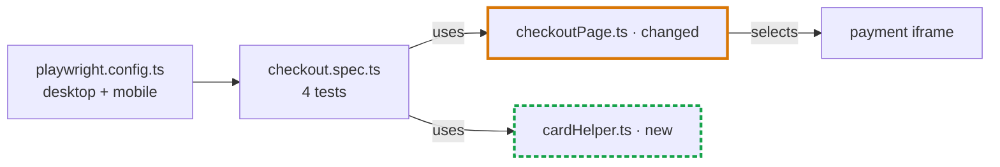

# PR Description

**Copilot prompt:** `#pr-description` | **Claude Code command:** `/pr-description`
**Copilot agent file:** `.github/agents/qa-pr-description.agent.md`
**Copilot prompt file:** `.github/prompts/pr-description.prompt.md`
**Claude Code command file:** `.claude/commands/pr-description.md`

---

## Purpose

Writes a reviewer-ready Pull Request description in Markdown from the repository's changes (committed, pushed, or not) and the current conversation. A reviewer can see what was wrong, why, what changed, and how it was verified without opening the ticket or reading the full diff. It is built for QA and automation PRs (test fixes, page object updates, new coverage), and it also handles product bug fixes, features, refactors, and chores.

## How to Use

### GitHub Copilot
1. Open Copilot Chat in VS Code, in the repository and session where you made the changes.
2. Type `#pr-description`. Optionally add a ticket ID, a base branch, or notes.

### Claude Code
1. Open Claude Code in the repository and session where you made the changes.
2. Type `/pr-description`. Optionally add a ticket ID, a base branch, or notes (e.g. `/pr-description SHOP-1234 base=develop`).

Running it in the same chat session where you made and tested the changes gives the best result. That session holds the test runs, root cause findings, and decisions the agent uses for the Root cause and Verification sections.

## What the Agent Collects

Input is optional. The agent gathers context on its own with **read-only** git commands and the current conversation:

| Source | How | Used for |
|---|---|---|
| Branch and base | Current branch; base = user-named, else `origin/HEAD`, else `main` / `master`. On the base branch itself, compares with its remote | Scope of the PR |
| Commits ahead of base (pushed or not) | `git log <base>..HEAD` | Change history, ticket ID |
| Committed diff | `git diff <base>...HEAD` | Changes section |
| Staged and unstaged changes | `git status --porcelain`, `git diff HEAD` | Changes section |
| Untracked files | `git ls-files --others --exclude-standard` + file contents | Changes section |
| Conversation | Request, ticket, root cause findings, decisions, commands actually run and their output | Summary, Root cause, Verification, Notes |
| User input (optional) | Ticket ID, base branch, notes, test output | Overrides anything inferred |

It skips generated outputs (`qa-agent-hub/response/`), build artifacts, and lockfile-only churn. It never commits, pushes, checks out, stashes, resets, or runs the test suite unless asked.

The ticket ID comes from user input, the conversation, the branch name, or commit messages, in that order. If none is found, the title has no ID and the gap is flagged.

The agent only asks for input when there is nothing to describe: no commits ahead of the base, no local changes, and nothing relevant in the conversation.

## PR Types

The agent classifies the PR and adjusts the sections:

| Type | Required sections |
|---|---|
| Bug fix | Summary, Root cause, Changes, Verification |
| Test fix | Summary, Root cause, Changes, Verification |
| Feature | Summary, Why, Changes, Verification |
| Refactor | Summary, Why, Changes, Verification (behavior unchanged) |
| Chore | Summary, Why, Changes, Verification |

**Notes for reviewers** is added whenever there is something a reviewer must know. Sections that would only hold filler are skipped.

## Output

A paste-ready PR description that fits on one screen for a small PR:

| Part | Content |
|---|---|
| **H1 title** | `<TICKET-ID>: <Outcome-focused title>`, used as the PR title |
| **Meta lines** | Ticket · Type · Risk (with a one-phrase reason), then **Result**: before → after with scope |
| **Summary** | 2–3 sentences: what was wrong, what the PR does, the key insight. Written to stand alone in notifications and squash commits |
| **Root cause** (or **Why**) | One bullet per cause with its scope and inline evidence (`old` → `new`, errors, counts). Optional *Reported as / Real cause* table when 3+ tests or flows were affected |
| **Changes** | A Mermaid flowchart of the files and layers involved (config → fixture → spec → page object → app), with changed and new files highlighted. Then a `File \| Change \| Why` table and an **Unchanged** line |
| **Verification** | Exact command, a compact result matrix (tests × projects), static checks, evidence links, and **Not covered** |
| **Notes for reviewers** | At most 4 bullets: shared/prod side effects, external dependencies, review order, rollback/follow-ups, "if it breaks again" |

No DOM, folder, or call-chain trees. The diagram and the diff already show structure.

### Mermaid diagram

Added when the change touches 2+ files or layers, or when one changed file is used by several tests or flows. Skipped for trivial one-file changes and docs-only PRs.

- At most 10 nodes. File names, not full paths.
- Changed files: ` · changed` in the label plus an orange border. New files: ` · new` in the label plus a green dashed border. Only the border changes, so the diagram reads well in light and dark themes.
- Edges are labelled with the relation (`uses`, `selects`, `loads`). Dotted edges mark conditional paths, such as `mobile only`.
- GitHub and GitLab render Mermaid. Other tools show the code block as text.

The chat response opens with one line naming the branch, base, and change sources found. After the description, it adds a short **Before you post** list of gaps the author must fill (missing ticket ID, files still uncommitted or untracked, unconfirmed inferences, missing test evidence). The list appears in chat only and is not saved to the file.

### Risk Scale

| Level | Meaning |
|---|---|
| **Low** | Test-only, docs, or isolated change with clear verification |
| **Medium** | Production code with limited blast radius, or partial verification |
| **High** | Shared contracts, auth, payments, data migrations, wide refactors, or missing verification on a critical path |

## Example

See [`qa-agent-hub/examples/pr-description.md`](../examples/pr-description.md).

## Saved File Location

`qa-agent-hub/response/pr-description/YYYY-MM-DD-<slug>.md`

## Information Sources

| Source | Copilot path | Claude Code location |
|---|---|---|
| QA Core | `.github/instructions/qa-core.instructions.md` | `## QA Core Guidance` in `.claude/CLAUDE.md` |
| Documentation Output | `.github/instructions/documentation-output.instructions.md` | `## Documentation Output Guidance` in `.claude/CLAUDE.md` |
| Automation | `.github/instructions/automation.instructions.md` | `## Automation Guidance` in `.claude/CLAUDE.md` |
| Jira QA | `.github/instructions/jira.instructions.md` | `## Jira QA Guidance` in `.claude/CLAUDE.md` |
