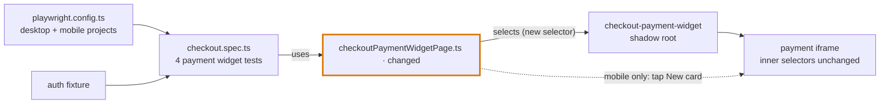

# SHOP-1234: Fix broken payment widget tests in checkout

**Ticket:** SHOP-1234 · **Type:** Test fix · **Risk:** Low (page object only, verified on desktop + mobile)
**Result:** 4/4 failing (scheduled run 2026-10-05) → 4/4 passing on staging, desktop + mobile

All four payment widget tests in checkout were failing with `element(s) not found`. The ticket blamed four bad locators, but the real cause was one renamed wrapper around the payment iframe, plus a different default tab on mobile. One page object changes. Every inner locator stays as it was.

## Root cause

- **Iframe wrapper renamed (all 4 tests):** every locator enters the widget through `payment-widget_iframe_container>iframe`, which now matches 0 elements. The iframe moved into the open shadow root of the `checkout-payment-widget` element. Playwright CSS pierces open shadow roots, so `checkout-payment-widget iframe` matches 1, and all inner selectors work again.
- **Mobile opens a different tab (mobile `/checkout` only):** a fresh mobile load opens **Saved cards**, which has no card form. `.card-form` only exists on **New card**. The selector was right, but the test was checking the wrong screen.

| Test | Reported as | Real cause |
|---|---|---|
| Desktop `/checkout` | Bad locator | Wrapper renamed |
| Desktop `/checkout/express` | Bad locator | Wrapper renamed |
| Mobile `/checkout` | Card form missing | Wrapper renamed + mobile default tab |
| Mobile `/checkout/express` | Bad locator | Wrapper renamed |

## Changes



| File | Change | Why |
|---|---|---|
| `pageObjects/checkoutPaymentWidgetPage.ts` | Iframe selector `payment-widget_iframe_container>iframe` → `checkout-payment-widget iframe` | Fixes all 4 tests |
| `pageObjects/checkoutPaymentWidgetPage.ts` | `verifyCardFormVisible()` taps **New card** on mobile first, by tab id + icon | Card form only exists on that tab. No dependency on translated text |

**Unchanged:** the spec, the auth fixture, the Playwright config, and every other selector.

## Verification

```bash
ENV=staging npx playwright test tests/e2e/checkout.spec.ts -g "Payment widget" --workers=1
```

| Test | Desktop | Mobile |
|---|---|---|
| Payment widget on checkout | ✅ 19.7s | ✅ 17.4s |
| Payment widget on express checkout | ✅ 13.3s | ✅ 17.1s |

Setup project (`authenticate`) passed in 5.0s. TypeScript and ESLint pass on the changed file.

**Not covered:** production and WebKit. Only staging was run, on Chromium desktop and mobile emulation.

## Notes for reviewers

- **Low footprint on shared staging:** 1 worker, 2 logins, no orders placed and no payments submitted.
- **Third-party dependency:** the widget loads from the payment provider's sandbox. If the sandbox is down, all 4 tests fail at the iframe. That was already true before this change.
- **If it breaks again:** when every test fails at its first check inside the iframe, check the host element before changing inner locators.
